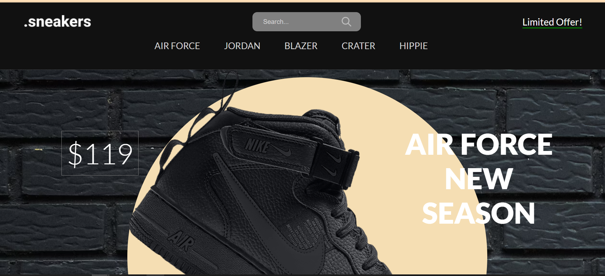
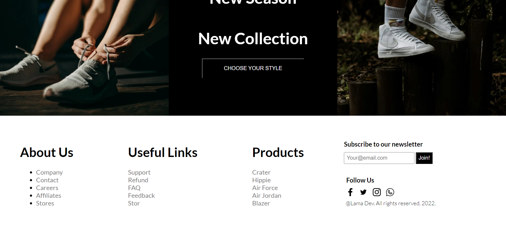

# Shoes E-commerce Website

A fully responsive e-commerce website for selling shoes. This project is built using HTML, CSS, and JavaScript, and showcases various shoe collections with a sleek and modern design.



## Table of Contents

- [Features](#features)
- [Technologies](#technologies)
- [Usage](#usage)
- [Screenshots](#screenshots)
- [License](#license)

## Features

- **Responsive Design**: The website adapts to different screen sizes for a smooth user experience on desktops, tablets, and mobile devices.
- **Product Slider**: Interactive product slider showcasing various shoe collections.
- **Search Functionality**: A search bar to easily find products.
- **Payment Section**: A simulated payment section where users can enter their details.
- **Product Filters**: Filter products by different sizes and colors.
- **Newsletter Subscription**: Allows users to subscribe to the newsletter.
- **Social Media Links**: Icons linking to various social media platforms.

## Technologies

- **HTML5**: Structuring the website content.
- **CSS3**: For styling the website and making it responsive.
- **JavaScript**: Adding interactivity, such as the product slider and menu features.
- **Google Fonts**: Lato font for a clean look.
- **Unsplash and Pexels Images**: Used for shoe collection images.

## Usage

1. Clone this repository to your local machine:

    ```bash
    git clone https://github.com/yourusername/shoes-ecommerce-website.git
    ```

2. Open the project in your code editor and navigate to the project directory.
3. Open the `index.html` file in your browser to view the website.

## Screenshots

Here are some screenshots of the website:

### footer page


<!-- ### Product Slider
 -->
<!-- 
### Payment Section
 -->

<!-- ### Footer and Subscription
 -->

## License

This project is licensed under the MIT License. See the [LICENSE](./LICENSE) file for more details.

---

**gmail**: abdullahbashir6563@gmail.com 
**Date**: September 2024
